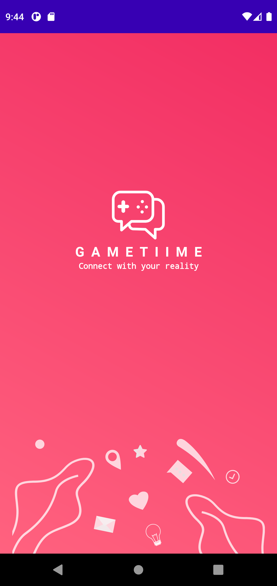
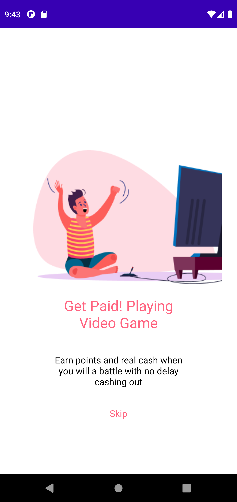
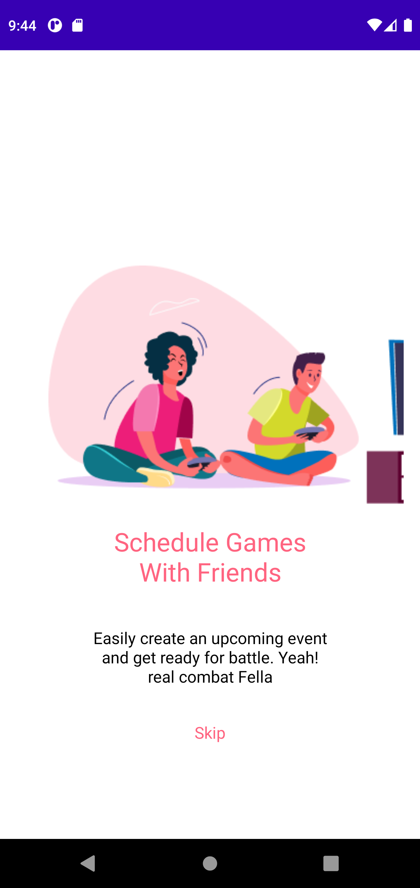
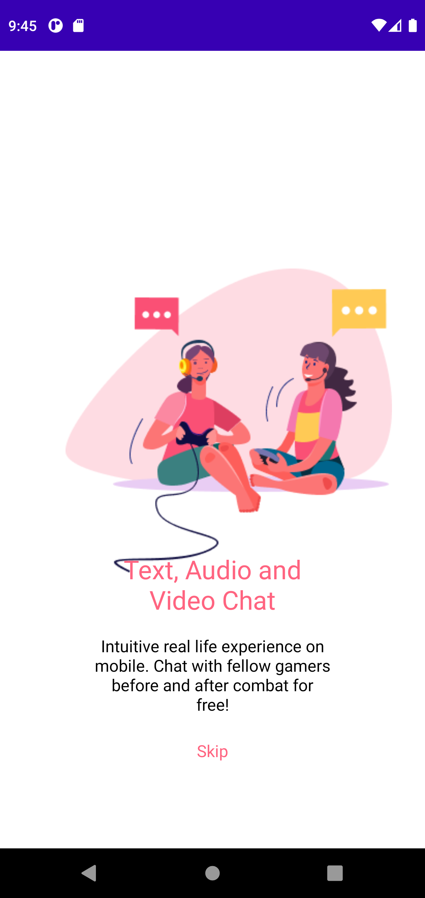
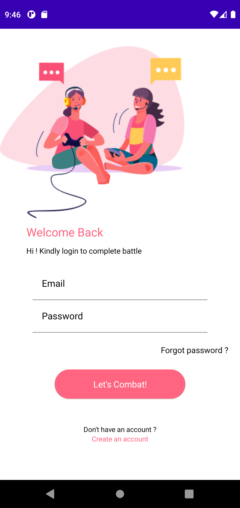
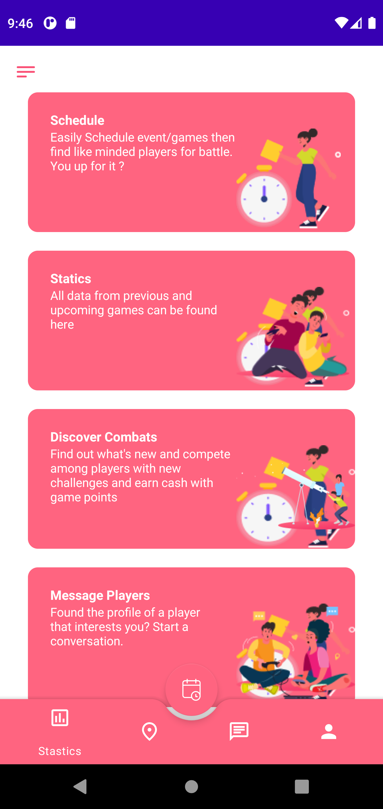

# gameTime

|
|
|

### gameTime was made using Kotlin, JetPack Compose, JetPack Navigation, lifecycle, retrofit, MongoDb and Firebase. 
###### BackEnd can be found on here : 
 
 
 
 
 

###### UI can be found here : 
###### https://www.figma.com/file/RzXk8AWN7Sf8nHwI9j4JoJ/GAAMETIIME-MOBILE-UI-KIT-(Community)?node-id=1%3A6036
###### All rights reserved to their respective owner. 

